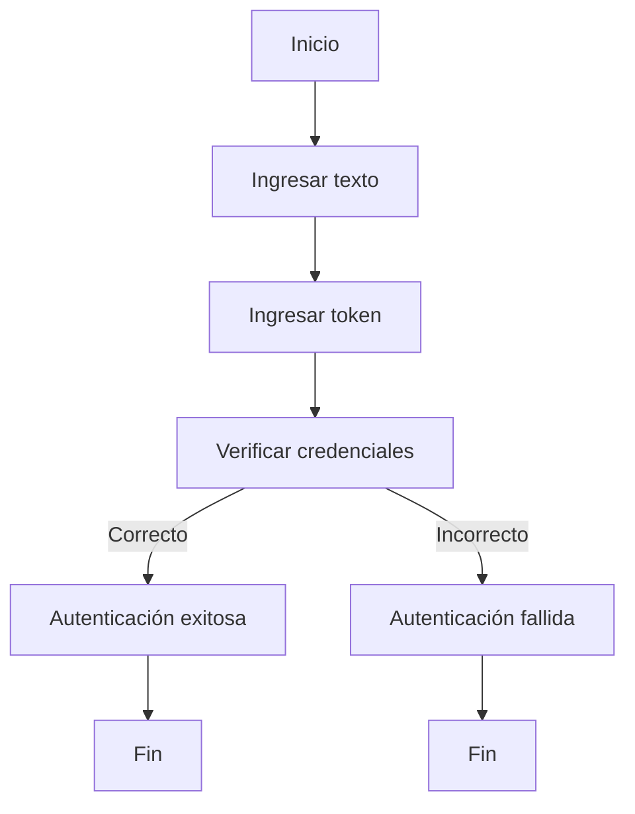

# Sanctuaryx/AuthText

## Instalación

Para instalar el repositorio Sanctuaryx/AuthText, es necesario clonar el repositorio en el entorno de desarrollo local. Usa el siguiente comando en la terminal para clonar el repositorio:

```bash
git clone https://github.com/Sanctuaryx/AuthText.git
```

Después de clonar el repositorio, navega hasta el directorio principal del proyecto:

```bash
cd AuthText
```

Asegúrate de instalar todas las dependencias requeridas ejecutando el gestor de paquetes correspondiente según el entorno de desarrollo que utilices. Si el proyecto utiliza `npm`, ejecuta:

```bash
npm install
```

Si utiliza otro gestor, revisa la documentación incluida en el repositorio para instrucciones específicas.

## Requisitos

El proyecto Sanctuaryx/AuthText requiere los siguientes componentes para su funcionamiento:

- Node.js versión 14 o superior.
- Un gestor de paquetes compatible, como `npm` o `yarn`.
- Acceso a internet para descargar dependencias externas.
- Un entorno compatible con JavaScript o el lenguaje que el repositorio utilice según su estructura de archivos.

Verifica que todas las dependencias listadas en el archivo de configuración del proyecto estén correctamente instaladas antes de ejecutar o modificar el código.

## Introducción

Sanctuaryx/AuthText es una solución diseñada para la autenticación y gestión de texto seguro. El repositorio ofrece herramientas para validar, procesar y autenticar cadenas de texto de manera segura en aplicaciones modernas. Su arquitectura modular permite integrar funciones de autenticación en proyectos nuevos o existentes de manera sencilla.

El sistema está enfocado en brindar seguridad en el manejo de texto, permitiendo validaciones y comprobaciones específicas según las necesidades de la aplicación. Las funciones y utilidades incluidas facilitan la implementación de flujos de autenticación personalizados.

## Uso

Para comenzar a utilizar las funcionalidades de Sanctuaryx/AuthText en tu proyecto, importa los módulos necesarios según la estructura del código y sigue los pasos que se describen a continuación.

### Ejemplo de Importación

Supón que deseas utilizar las utilidades de autenticación de texto. Puedes importar los módulos de la siguiente manera (ajusta la ruta según la estructura de carpetas):

```js
const { AuthText } = require('./src/authText');
```

### Ejemplo de Autenticación de Texto

Utiliza las funciones provistas por el repositorio para autenticar texto de la siguiente forma:

```js
const isValid = AuthText.verify('cadena_de_texto', 'token_secreto');
console.log(isValid); // true o false
```

### Flujo General

A continuación se presenta un diagrama de flujo que describe la lógica general de autenticación en el sistema:



### Estructura de Archivos

El repositorio está organizado en módulos que separan la lógica de autenticación y las utilidades relacionadas. Revisa los archivos dentro del directorio `src` para identificar los puntos de entrada y las funciones disponibles.

### Pruebas

Para ejecutar las pruebas incluidas en el repositorio, utiliza el comando de pruebas correspondiente, por ejemplo:

```bash
npm test
```

Esto ejecutará la suite de pruebas y mostrará los resultados en la terminal.

---

Sanctuaryx/AuthText es una solución modular y segura para la autenticación de texto, ideal para aplicaciones que requieren validaciones y comprobaciones robustas. Consulta la documentación del código para detalles adicionales sobre las funciones y utilidades disponibles.